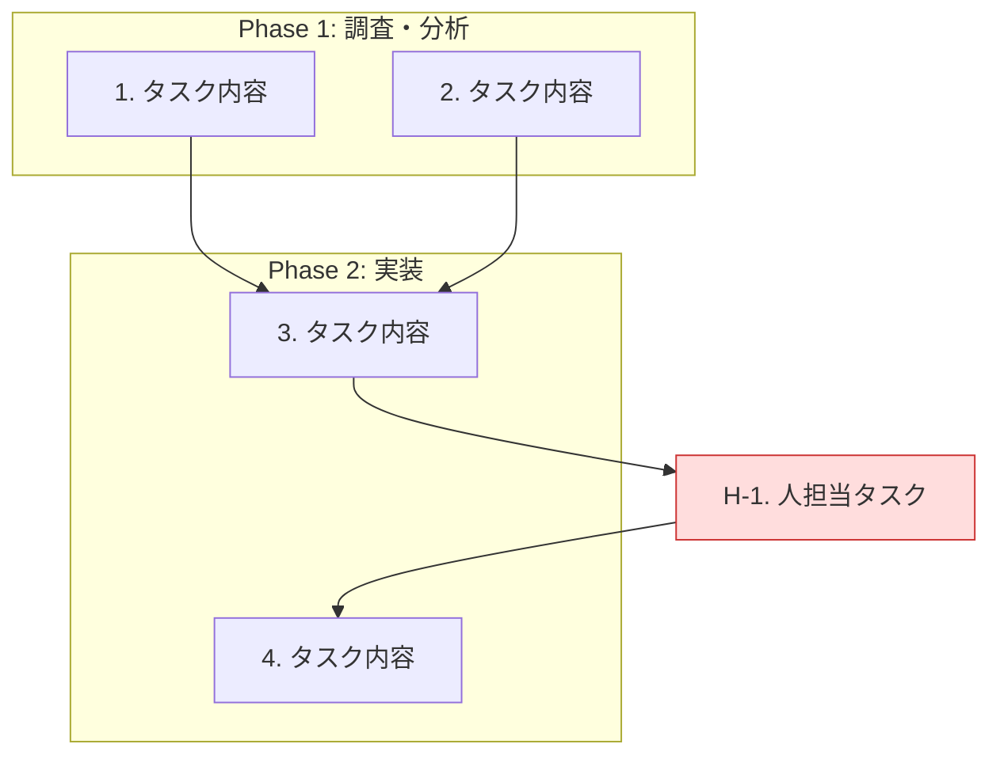

# アウトプットフォーマット仕様

## ファイル出力先

`.outputs/claude/<チケットキー>-todos.md`

出力前に `mkdir -p .outputs/claude` を実行してディレクトリを作成する。

## 構成（7セクション、この順序で出力）

### セクション1: 背景

チケットの目的と背景を2〜3段落で要約する。

### セクション2: 完了条件

チケットのacceptance criteriaを箇条書きで記載する。

### セクション3: 既存設計・関連ドキュメントの要約

関連ADR・Confluenceページの要約を表形式で記載する。

| ドキュメント | 種別 | 要約 | URL |
|------------|------|------|-----|
| ADR-XXX: タイトル | ADR | 要約テキスト | URL |

### セクション4: 対象領域の現状

対象コード・設定の現状を表形式で記載する。

| 対象 | 現状 | 備考 |
|------|------|------|
| ファイル/設定名 | 現在の状態の説明 | 補足情報 |

### セクション5: AI担当TODO

Phase別にグルーピングして記載する。

```markdown
## Phase 1: 調査・分析

| # | TODO | 完了条件 |
|---|------|---------|
| 1 | タスク内容 | 完了の判断基準 |
| 2 | タスク内容 | 完了の判断基準 |

## Phase 2: 実装

| # | TODO | 完了条件 |
|---|------|---------|
| 3 | タスク内容 | 完了の判断基準 |
```

### セクション6: 人担当TODO

人が担当すべきタスクを1テーブルで記載する。番号には `H-` プレフィックスを付ける。

| # | TODO | 理由 | 完了条件 |
|---|------|------|---------|
| H-1 | タスク内容 | AIが担当できない理由 | 完了の判断基準 |

### セクション7: 実行フロー

TODO間の順序・依存関係をmermaid図で表現する。並列実行可能なタスクは同じ段に配置し、人担当タスク（H-x）との受け渡しポイントを明示する。

````markdown

````

mermaid図のルール:
- AI担当TODOは番号のみ（例: `1. タスク内容`）
- 人担当TODOは `H-` prefix付き、`human` classで色分け
- 並列実行可能なタスクは依存関係の矢印を持たない
- Phase境界は `subgraph` で表現
